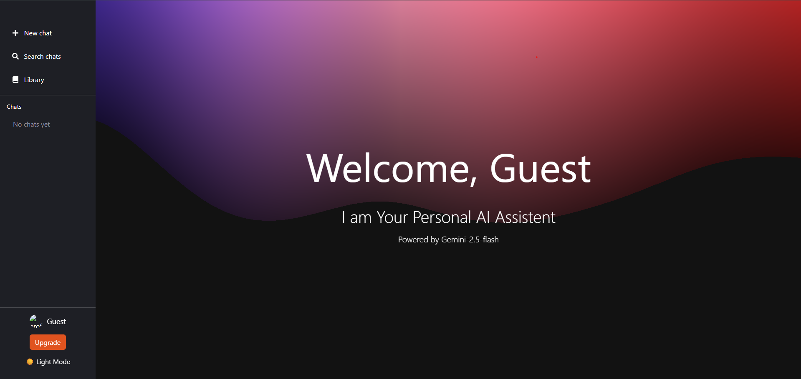
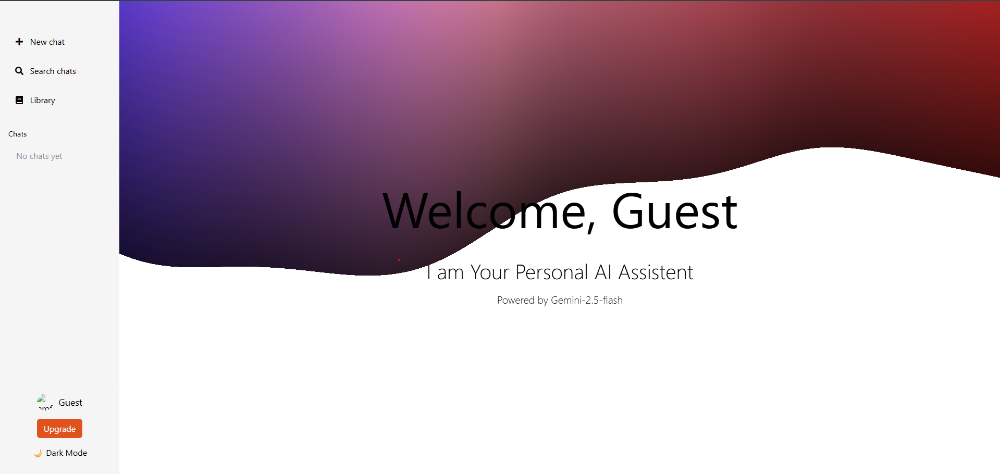
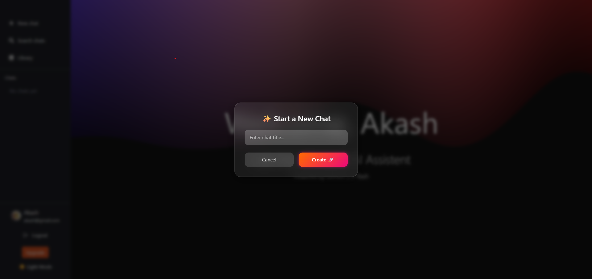
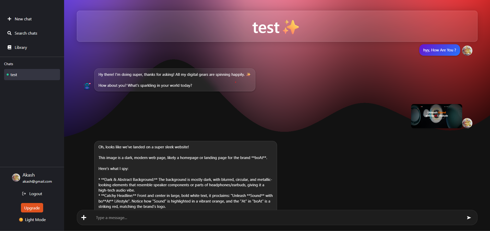

🤖 AI-Chatbot Backend

⚡ 🚀 A scalable AI-Chatbot application with real-time messaging, AI-powered responses, and modern UI.
Built with React (Frontend) + Node.js/Express (Backend) + MongoDB & Redis (Pinecone).

## 📸 UI Preview

### 🔹 Welcome Screen

### 🔹 Chat UI (Light Mode)

### 🔹 Chat-1 UI

### 🔹 Chat-2 UI

🌐 Live Demo

🔗 [AI_Chatbot](https://ai-chatbot-1-qxr6.onrender.com/)

💻 GitHub Repository

🔗 (https://github.com/Akash-dev-lab/AI-chatbot)

✨ Features

🔹 Backend

    1. Real-time messaging with Socket.IO

    2. JWT Authentication + Protected routes

    3. Redis (Pinecone) Vector DB for AI search & semantic memory

    4. MongoDB for persistent chat storage

    5. AI middleware integration with Gemini-2.5

🔹 Frontend

    1. Modern React + Vite setup

    2. Redux Toolkit for state management

    3. Framer Motion animations for smooth UI

    4. TailwindCSS for responsive design

    5. Dark/Light mode with theme persistence

    6. Chat interface with image uploads + zoom preview

🛠️ Tech Stack

1. Frontend → React, Vite, Redux Toolkit, TailwindCSS, Framer Motion

2. Backend → Node.js, Express, Socket.IO, MongoDB, Redis/Pinecone, JWT

3. AI Service → Gemini-2.5 / LLM API

📂 Project Structure

AI-CHATBOT/
│── backend/               # Node.js + Express + Socket.IO
│   ├── public/            # Serving Files
│   ├── controllers/       # Route handlers
│   ├── middlewares/       # Auth, error handling
│   ├── socket/            # Real Team communication
│   ├── utils/             # ImageKit Services
│   ├── models/            # Mongoose schemas
│   ├── routes/            # API routes
│   ├── services/          # AI + Redis
│   └── server.js          # Server entry
│
│── frontend/              # React + Vite
│   ├── public/            # Serving Files
│   ├── src/
│   │   ├── components/    # Sidebar, ChatArea, etc.
│   │   ├── features/      # Redux slices
│   │   ├── styles/        # CSS modules
│   │   ├── pages/
│   │   └── App.jsx
│   └── store/             # Redux Store
│   └── vite.config.js
│   └── socket.js          # socket-io client
│
└── README.md

🚀 Getting Started

    🔹 Backend Setup

       --> cd backend
       --> npm install
       --> npm start

Create a .env file inside backend/:

    --> PORT=3000
    --> MONGO_URI=your_mongodb_url
    --> PINECONE_API_KEY=your_pinecone_api
    --> JWT_SECRET_KEY=your_secret_key
    --> GEMINI_API_KEY=your_gemini_api_key
    --> IMAGEKIT_PUBLIC_KEY=your_imagekit_public_key
    --> IMAGEKIT_PRIVATE_KEY=your_imagekit_private_key
    --> IMAGEKIT_URL_ENDPOINT=your_imagekit_url_endpoint

🔹 Frontend Setup

    --> cd frontend
    --> npm install
    --> npm run dev

📡 API & Socket Endpoints (Protected Routes)

    --> Auth Routes

        --> POST /api/auth/register → Register user
        --> POST /api/auth/login → Login
        --> GET /api/auth/profile → profile
        --> POST /api/auth/logout → Logout
        --> POST /api/auth/authUser/upload-profile → upload your profile with (multer)

    --> Chat Routes

        --> POST /api/chat/ → create chats
        --> GET /api/chat/ → get chats

    --> Message Routes

        --> GET /api/message/:chatId → Retrieve old messages

    --> Socket Events

        --> ai-message → Client → Server
        --> ai-response → Server → Client

🏗️ Architecture

    graph TD

        A[React Frontend] -->|Socket.IO + REST| B[Backend Server]
        B -->|Auth + Middleware| C[JWT + Services]
        B -->|Store Chats| D[MongoDB]
        B -->|Vector Search| E[Redis / Pincone]
        B -->|AI Query| F[Gemini API]

🤝 Mentions

Special thanks to my mentors Ankur Bhaiya 😊😊 [(https://github.com/ankurdotio)]

📬 Contributing

Contributions are welcome! Fork, raise issues, and open PRs 🚀

📜 License

MIT © 2025 [Akash-dev-dab]

⚡ Scalable AI-powered communication for the next generation.